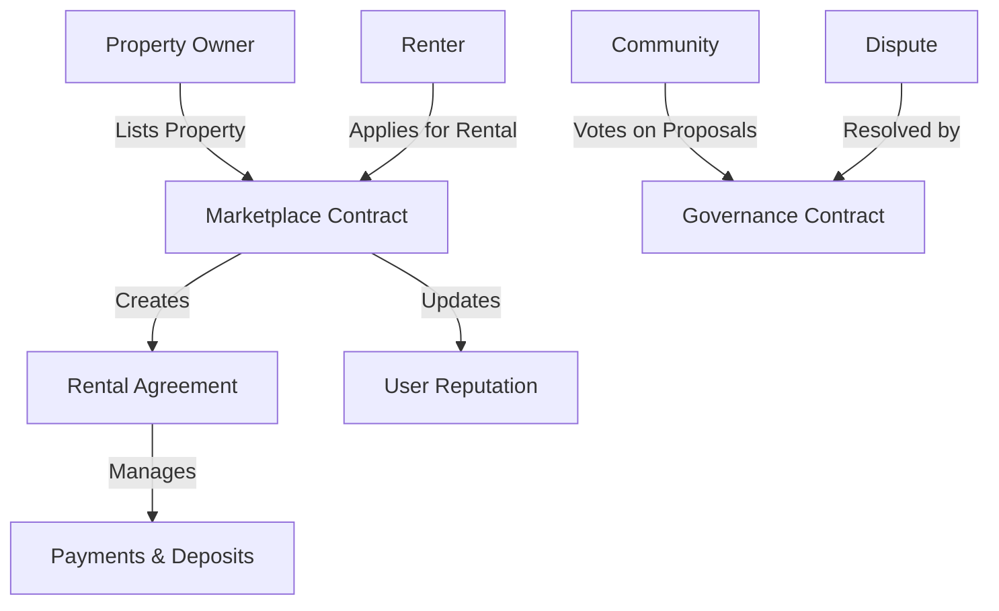

# FairNest Rental Marketplace

A decentralized rental marketplace enabling trustless property rentals through smart contracts on the Stacks blockchain.

## Overview

FairNest is a blockchain-based platform that connects property owners directly with potential renters, eliminating traditional intermediaries while maintaining security and trust through smart contracts. The platform handles:

- Property listings and tenant applications
- Automated rental agreements
- Secure payment and deposit management  
- Reputation system for owners and renters
- Decentralized dispute resolution
- Community governance

## Architecture

The platform consists of two main smart contracts:

1. **Marketplace Contract** - Handles core rental operations
2. **Governance Contract** - Manages platform governance and dispute resolution



## Contract Documentation

### Marketplace Contract (`fairnest-marketplace.clar`)

The core contract managing rental operations.

Key Functions:
- `create-listing` - List a property for rent
- `apply-for-rental` - Submit rental application
- `approve-application` - Accept a tenant's application
- `pay-rental` - Process rental payment and deposit
- `complete-rental` - Complete rental and release funds
- `leave-review` - Submit review for owner/renter

### Governance Contract (`fairnest-governance.clar`)

Handles platform governance and dispute resolution.

Key Functions:
- `create-proposal` - Submit governance proposal
- `vote-on-proposal` - Vote on active proposals
- `create-dispute` - Raise rental dispute
- `submit-arbitration-vote` - Arbitrator voting on disputes

## Getting Started

### Prerequisites
- [Clarinet](https://github.com/hirosystems/clarinet)
- [Stacks Wallet](https://www.hiro.so/wallet)

### Local Development

1. Clone the repository
2. Install dependencies:
```bash
clarinet install
```
3. Run tests:
```bash
clarinet test
```

## Function Reference

### Marketplace Functions

```clarity
(create-listing 
  (title (string-ascii 100))
  (description (string-utf8 500))
  (location (string-ascii 100))
  (price-per-night uint)
  (security-deposit uint)
  (min-nights uint)
  (max-nights uint)
  (amenities (list 20 (string-ascii 50)))
  (availability-start uint)
  (availability-end uint))
```

```clarity
(apply-for-rental 
  (listing-id uint)
  (start-date uint)
  (end-date uint)
  (message (string-utf8 300)))
```

### Governance Functions

```clarity
(create-proposal 
  (title (string-utf8 100))
  (description (string-utf8 1000))
  (proposal-type uint)
  (parameter-key (optional (string-ascii 50)))
  (parameter-value (optional (string-utf8 500))))
```

```clarity
(create-dispute
  (rental-id uint)
  (description (string-utf8 1000))
  (evidence-hash (buff 32)))
```

## Development

### Testing

The test suite covers:
- Property listing lifecycle
- Rental application process
- Payment processing
- Dispute resolution
- Governance voting

Run tests:
```bash
clarinet test
```

### Contract Deployment

1. Build contracts:
```bash
clarinet build
```

2. Deploy to testnet:
```bash
clarinet deploy --network testnet
```

## Security Considerations

1. **Access Control**
   - Functions verify caller authorization
   - Separate permissions for owners, renters, and arbitrators

2. **Payment Security**
   - Atomic transactions for payments and deposits
   - Protected withdrawal mechanisms

3. **Input Validation**
   - All user inputs are validated
   - Date ranges and payment amounts checked

4. **Dispute Resolution**
   - Multi-signature requirement for dispute resolution
   - Timelock periods for major governance changes

5. **Known Limitations**
   - Fixed platform fee structure
   - Limited dispute resolution mechanisms
   - Manual arbitrator selection process